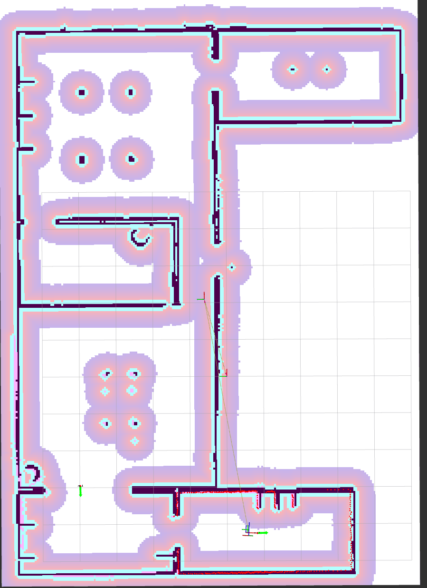
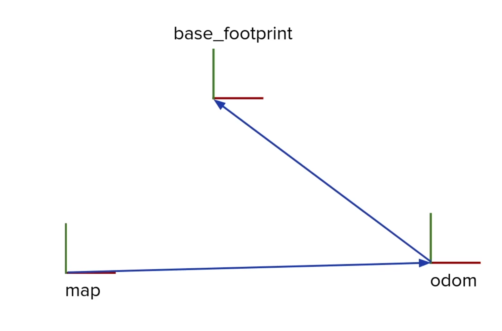
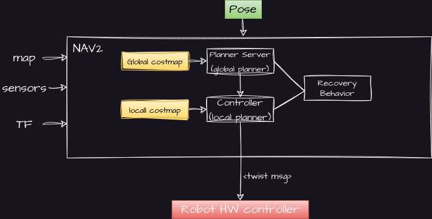

1. Launch turtlebot with gazebo:
```
ros2 launch turtlebot3_gazebo turtlebot3_world.launch.py
```

2. Launch Turtule bot with a saved map:
```
ros2 launch turtlebot3_navigation2 navigation2.launch.py map:=<path_to_map.yaml> use_sim_time:=True
```

# UNDERSTAND THE NAV2 STACK
## 1. GLOBAL PLANNER, CONTROLLER (LOCAL PLANNER), COSTMAPS
### 1.1. Global Planner
- Global planner is responsible to a global, long distance path from an initial position to goal.
- To Generate a path, the global planner needs two things:
    - A Map of the environment: Each cell is a binary represention if the cell it occupied or not. (occupied = 1, free = 0)
     

    - A cost map:
        A cost map assigns a cost to each pixel (cell) of the map. The cost is a value that represents how difficult is to navigate throught that cell.


    By summing these two maps, we generate a global cost map. The global planner uses this global cost map to generate a path from the initial position to the goal.

    | Occupancy Map | Cost Map | Global Cost Map |
    |:-------------:|:--------:|:---------------:|
    |  |  |  |
    
### 1.2 CONTROLLER (LOCAL PLANNER)
- The global planner generates a path from the initial position to the goal. The controller is responsible to follow this path. In other words, it is responsible to generate the velocity commands to the robot to follow the path. The update of the local planner is much faster relative to the global planner.

In reference to driving a car, the global planner is equivilant to the GPS, and the local planner is equivilant to the steering wheel, accelrating and applying the brakes according to actual situation on the road.

- To improve efficiency, the local planner analyzes a much smaller map. This map is called the local cost map. It is centered on the robot position.

In the following image the local cost map is visible, along with the local path generated by the local planner.


| Local Cost Map | Local Path |
|:--------------:|:----------:|
|  |  |


## RECOVERY SERVER and RECOVERY BEHAVIORS
Recovery behaviors are a set of predefined behaviors that the robot can execute when it is stuck, as can sometimes happen is real world scenarios. 
- If the global planner is unable to generate a path, or the local planner is unable to follow path, then the recovery server is called.
- For example: spin 90 degrees, move back 1 meter, then try again.


## THE TF
- The TFs are sets of frames and the transformations between them, which are updated and kept over time. ROS2 uses a few packages to handle the transformations:

- `state_publisher` and `joint_state_publisher` packages: 
  - Publishes the state of the frames (links and joints) of the robot according to URDF.

- The TF2 package:
  - Keeps track of each 3D coordinate frame **over time**
  - Structured tree containing all the frames.
  - To get TFs from the robot, use the package **robot_state_publisher**. It publishes the TFs according to the URDF.

Important frames:
    - `map`: The global frame of the map.
    - `odom`: The frame of the odometry.
    - `base_link`: The frame of the robot base.


The tranformation between `map` and `base_link` is used to calcaulate the position of the robot relative to the world. The location is stable over long term, but can be inacuurate over short term. 

The `odom` frame is an estimation of the robot location based on its internal measurements. The location is accurate and smooth over short time periods, but can drift over long time periods.



As a consequence, the `odom` frame may jump around, but the location of `base_link` relative to `map` is stable over time.

# NAV2 STACK
Before looking into the official NAV2 architecture drawing, let's look at a simpliefied version of the architecture.


In order to make NAV2 work we need to provide it with the following inputs:
> **MAP**: A map of the environment.
> 
> **TF**: The transformation between the map and the robot base.
> 
> **Sensor Data**: The sensor data from the robot, such as laser scans/ point clouds/ depth images/ odometry. 


Next, we send a **Pose Goal**. What happens then?

