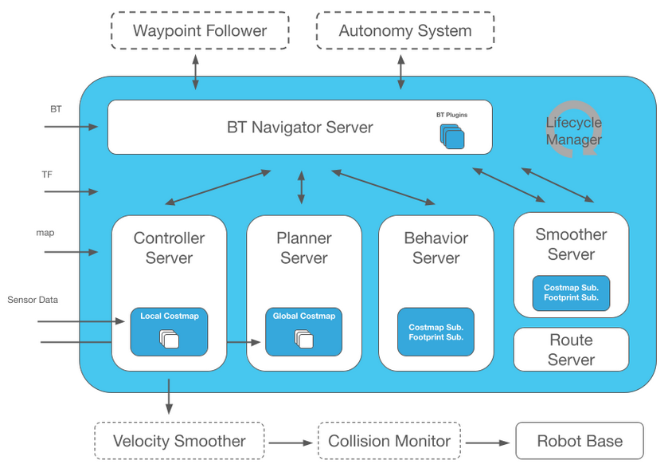
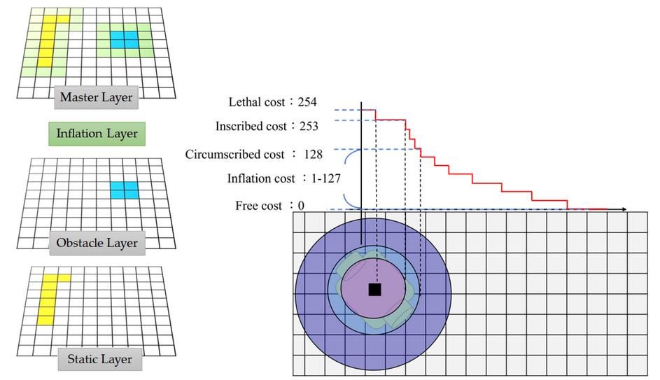
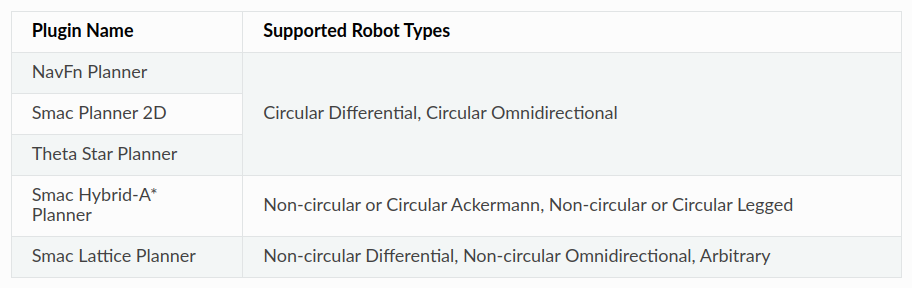

# UNDERSTAND THE NAV2 STACK
This document will give an overview of Nav2 stack, and the main conecpts for robot autonomous navigation.


Before diving into the details, let's first go over the inputs required for the Nav2 stack to work.

### TF
- The TFs are sets of frames and the transformations between them, which are updated and kept over time. ROS2 uses a few packages to handle the transformations:

- `state_publisher` and `joint_state_publisher` packages: 
  - Publishes the state of the frames (links and joints) of the robot according to URDF.

- The TF2 package:
  - Keeps track of each 3D coordinate frame **over time**
  - Structured tree containing all the frames.
  - To get TFs from the robot, use the package **robot_state_publisher**. It publishes the TFs according to the URDF.

Important frames:
    - `map`: The global frame of the map.
    - `odom`: The frame of the odometry.
    - `base_link`: The frame of the robot base.

The tranformation between `map` and `base_link` is used to calcaulate the position of the robot relative to the world. The location is stable over long term, but can be inacuurate over short term. 

The `odom` frame is an estimation of the robot location based on its internal measurements. The location is accurate and smooth over short time periods, but can drift over long time periods.


As a consequence, the `odom` frame may jump around, but the location of `base_link` relative to `map` is stable over time.

### SENSOR DATA:
A collection of data from robot sensors, such as laser scans, point clouds, depth images, odometry, etc. This sensors are used to create the map of the environment and localize the robot.

### MAP:
A map of the environment. In basic form, Nav2 works with 2D representation of the environment. The Map in supplied as a 2D occupancy grid. Each cell in the grid represents if the cell is occupied, free or unknown. 


### BT (Behavior Trees)
Nav2 uses [BehaviorTree.CPP](https://www.behaviortree.dev/) for managing high level control flows. A few examples will be given below.

### Lifecycle Manager:
Nav2 relies on lifecycle nodes. The lifecycle manager is responsible for starting, stopping, pausing, resuming, etc. the nodes.


---
We shall now look at Nav2 main components:

# The idea of costmaps:
At the heart of path planning is the idea of costmaps. The idea is to generate a monolithic costmap used for path planning, which is generated as a combination of multiple layers. Each of the layers represents a different aspect of the environment. For example, one layer represents the static obstacles, another layer represents the dynamic obstacles, and another layer represents the robot footprint. The costmap is generated as a weighted sum of all the layers. The weights are configurable, and can be changed to give more importance to one layer over another. The costmap is used by the global planner to generate a path from the initial position to the goal, and by the local planner to generate velocity commands to follow the path.



A costmap is a 2D grid that assigns a cost to each cell. The cost is a value that represents how difficult is to navigate throught that cell. The costmap is used by the global planner to generate a path from the initial position to the goal.

Here is an example from Nav2 with a simulated environment:
| Occupancy Map | Inflation Layer | Global Cost Map |
|:-------------:|:--------:|:---------------:|
|  |  |  |

# Planner Server:
The general task in Nav2 for the planner is to compute a valid, and potentially optimal, path from the current pose to a goal pose.
The global planner takes the global cost map as input, and generates the path from the initial position to the goal. Since this might be heavy to compute, the frequency of the global planner is much lower compared to the local planner.


Here are some examples of global planners available in Nav2:



# Controller Server (LOCAL PLANNER):
In reference to driving a car, the global planner is equivilant a generated road map, and the local planner is equivilant to steering the wheel, accelrating and applying the brakes according to actual situation on the road. In other words, it is responsible to generate the velocity commands to the robot to follow the path safely. 

The local planner analyzes a much smaller map, called the local cost map. It is centered on the robot position and updates very fast. The output of the local planner is the `/cmd_vel` topic, which is the velocity commands relative to the robot `base_link`.

Avialable controllers in Nav2:


| Local Cost Map | Local Path |
|:--------------:|:----------:|
|  |  |


Example of DWB controller:


## RECOVERY SERVER and RECOVERY BEHAVIORS
Recovery behaviors are a set of predefined behaviors that the robot can execute when it is stuck, as can sometimes happen is real world scenarios. 
- If the global planner is unable to generate a path, or the local planner is unable to follow path, then the recovery server is called.
- For example: spin 90 degrees, move back 1 meter, then try again.

# NAV2 STACK
Before looking into the official NAV2 architecture drawing, let's look at a simpliefied version of the architecture.


In order to make NAV2 work we need to provide it with the following inputs:
> **MAP**: A map of the environment.
> 
> **TF**: The transformation between the map and the robot base.
>  - `map` -> `odom`
>  - `odom` -> `base_link`
> 
> **Sensor Data**: The sensor data from the robot, such as laser scans/ point clouds/ depth images/ odometry. 


Next, we send a **Pose Goal**. What happens then?


# ADAPTING A CUSTOM ROBOT TO NAV2
## *TF*

To adapt a custom robot to NAV2, we need to first provide the TF of the robot. This is done by using the `robot_state_publisher` package. This package requires the URDF and and the joint states of the robot. The joint states are published by the `joint_state_publisher` package.


In the URDF file there are two major keys:
- `link`: A link is a rigid body with an inertial frame and a collision frame. It can also have a visual frame (for example, a link can be a robot arm)
- `joint`: A joint is a connection between two links. Joint can be fixed or movable. For example, it can be the elbow of the robot arm, and it can rotate over time.

### ODOMETERY
> Used to localize a robot from its starting point, using its internal sensors. 
> 
> **Odometry will drift over time.**
> Will be corrected the map to odom transform.

Examples for odometry:
- Wheel odometry
- Foot odometry (step length)
- IMU (inertial measurement unit)
- Visual odometry (using cameras)

## HARDWARE CONTROLLER
The hardware controller is responsible to send velocity commands to the robot motors. 
In ourcase this is the learned policy.

There are two ways to communicate with the hardware controller:
- **Option 1**: writing our own controller interfaces
- **Option 2**: using the `ros2_control` package.


# RUN NAV2 WITH TURTULEBOT3 ON GAZEBO:
1. Launch turtlebot with gazebo:
```
ros2 launch turtlebot3_gazebo turtlebot3_world.launch.py
```

2. Launch Turtulebot with a saved map:
```
ros2 launch turtlebot3_navigation2 navigation2.launch.py map:=<path_to_map.yaml> use_sim_time:=True
```

# RUN NAV2 WITH A CUSTOM ROBOT:

Follow these steps to collect and save a map of the environment using the SLAM toolbox:
1. `ros2 launch nav2_bringup navigation_launch.py` 

   (Launch the navigation stack with the default parameters.)

1. `ros2 launch slam_toolbox online_async_launch.py` 

   (Will launch the SLAM toolbox with the default parameters.)

1. `rviz2`

   (Will launch RVIZ2.)

1. `ros2 run teleop_twist_keyboard teleop_twist_keyboard`
   (This will allow us to control the robot with the keyboard.
   This can also be replaced with a joystick.)

1. `ros2 run nav2_map_server map_saver_cli -f my_map`
   
   (This will save the map to the `my_map` file.)

-----

Follow these steps to use the saved map for navigation:
1. `ros2 launch nav2_bringup bringup_launch.py map:=<path_to_map.yaml>`


## SETTING UP LAUNCH FILES AND PARAMETERS
A much easier way to launch the navigation stack is to use a single launch file.

1. If NAV2 is installed on the computer, the launch and param files are found in /opt/ros/$ROS_DISTRO/share/nav2*/launch. 

Most of the launch files provide a good template for our own launch files.
They are also found on: [nav2 github repo](https://github.com/ros-planning/navigation2)
   

# INTERACT PROGRAMATICALLY WITH NAV2
NAV2 stack interacts with the robot using **`topics pubs`, `services` and `actions`.**
NAV2 also provides **Python API, (nav2_simple_commander)** which allows us to interact with the navigation stack programatically and fairly easily.


To install it:
> `sudo apt install ros-<rosdistro>-nav2-simple-commander`

The following will go through major functions of the `nav2_simple_commander` API:

## TOPICS:
| Topic Name | Message Type | Description |
|:----------:|:------------:|:-----------:|
| `/initalPose` | geometry_msgs/PoseWithCovarianceStamped | Publish the initial pose of the robot. |


```python
#!/usr/bin/env python3
import rclpy
from nav2_simple_commander.robot_navigator import BasicNavigator
from geometry_msgs.msg import PoseStamped
import tf_transformations

def create_pose_stamped(navigator: BasicNavigator, position_x, position_y, orientation_z):
    q_x, q_y, q_z, q_w = tf_transformations.quaternion_from_euler(0.0, 0.0, orientation_z)
    pose = PoseStamped()
    pose.header.frame_id = 'map'
    pose.header.stamp = navigator.get_clock().now().to_msg()
    pose.pose.position.x = position_x
    pose.pose.position.y = position_y
    pose.pose.position.z = 0.0
    pose.pose.orientation.x = q_x
    pose.pose.orientation.y = q_y
    pose.pose.orientation.z = q_z
    pose.pose.orientation.w = q_w
    return pose

def main():
    # --- Init
    rclpy.init()
    nav = BasicNavigator()

    # --- Set initial pose
    initial_pose = create_pose_stamped(nav, 0.0, 0.0, 0.0)
    nav.setInitialPose(initial_pose)

    # --- Wait for Nav2
    nav.waitUntilNav2Active()

    # --- Send Nav2 goal
    waypoints = []
    waypoints.append(create_pose_stamped(nav, 2.0, -2.0, 1.57))
    waypoints.append(create_pose_stamped(nav, 4.0, 0.8, 0.0))
    waypoints.append(create_pose_stamped(nav, 8.0, 1.0, -1.57))
    waypoints.append(create_pose_stamped(nav, 8.0, -0.5, 1.57))
    waypoints.append(create_pose_stamped(nav, 5.0, 5.0, 3.14))
    waypoints.append(create_pose_stamped(nav, 3.0, 4.0, 1.57))
    waypoints.append(create_pose_stamped(nav, 4.0, 5.0, 0.0))
    waypoints.append(create_pose_stamped(nav, 5.0, 3.0, -1.57))
    waypoints.append(create_pose_stamped(nav, 4.0, 0.8, 3.14))
    waypoints.append(create_pose_stamped(nav, -4.0, 3.5, -1.57))
    waypoints.append(create_pose_stamped(nav, -4.0, 0.0, 1.57))

    # --- Go to one pose
    # nav.goToPose(goal_pose1)
    # while not nav.isTaskComplete():
    #     feedback = nav.getFeedback()
    #     # print(feedback)

    # --- Follow waypoints
    nav.followWaypoints(waypoints)
    while not nav.isTaskComplete():
        feedback = nav.getFeedback()
        # print(feedback)

    print(nav.getResult())

    # --- Shutdown
    rclpy.shutdown()

if __name__ == '__main__':
    main()
```


## NAVIGATE TO POSE ACTION:
`NavigatToPose` action is most suitable for point to point navigation. Becuase it is a ROS ACTION, it reports feedback and results, that can be later monitored by the system (behavior tree for example).

This is the stacture of the action: 
```python
#goal definition
geometry_msgs/PoseStamped pose
string behavior_tree
---
#result definition
std_msgs/Empty result
---
# feedback definition
geometry_msgs/PoseStamped current_pose
builtin_interfaces/Duration navigation_time
builtin_interfaces/Duration estimated_time_remaining
int16 number_of_recoveries
float32 distance_remaining
```
The inputs to the action are:
- `pose` - The goal pose.
- `behavior_tree (optinal)` - The behavior tree to be executed during navigation. It will use the default behavior tree if non is specified.

# NAV2 SIMPLE COMMANDER
Nav2 provides python API to interact with the navigation stack programatically and fairly easily.
Here is a link to the documentation:
[nav2 simple commander documentation](https://navigation.ros.org/commander_api/index.html)

# BEHAVIOR TREES
Nav2 uses **Behavior Trees (BTs)** to control the robot's navigation behavior.
BTs are a way to control the flow of execution of a program based on a tree structure. Nav2 uses [*BehaviorTree.CPP*](https://www.behaviortree.dev/): a C++ library for behvaior trees. In the end behavior trees control the flow of execution, and decide which action to execute next, based on the current state of the robot, and the feedback from the different ROS nodes (very often they will be specifically ROS actions). 

:fire: **IMPORTANT:** You should not confuse **ROS nodes** with **behavior nodes**; those are two different things.

In the end a behavior tree is an xml file that describes the flow information and execution.
However, writing a large and complex xml file can be very painful and error prone. Also, debugging and understanding the behavior tree's state could be quite difficult. To simplify this, use [*GROOT*](https://www.behaviortree.dev/groot/). A visal tool to create, visualize and debug the tree exectuation, in real time.


## BT NAVIGATOR
The navigation system's package in charge of managing behavior trees is the **`nav2_bt_navigator`**. It is in charge of controlling the robot movements, and is composed of several parts:
- **`bt_navigator`** - The ros node and its configuration file
- **`xml file`** - The behavior tree file
- **`recoveries_server`** ros node and its configuration file.
   


### **The `bt_navigator` node**
This node is in charge of managing the *path planner*, the *controller* and the *recovery server*

#### **How to create a behavior**
To create the behavior, you must create the XML file using the types of node available, or create new ones as `behavior_tree_cpp` plugins.
Here is an example of GROOT's interface and the XML file it generates:

```xml
<!--
  This Behavior Tree replans the global path periodically at 1 Hz, and it also has
  recovery actions.
-->
<root main_tree_to_execute="MainTree">
  <BehaviorTree ID="MainTree">
    <RecoveryNode number_of_retries="6" name="NavigateRecovery">
      <PipelineSequence name="NavigateWithReplanning">
        <RateController hz="1.0">
          <RecoveryNode number_of_retries="1" name="ComputePathToPose">
            <ComputePathToPose goal="{goal}" path="{path}" planner_id="GridBased"/>
            <ClearEntireCostmap service_name="global_costmap/clear_entirely_global_costmap"/>
          </RecoveryNode>
        </RateController>
        <RecoveryNode number_of_retries="1" name="FollowPath">
          <FollowPath path="{path}" controller_id="FollowPath"/>
          <ClearEntireCostmap service_name="local_costmap/clear_entirely_local_costmap"/>
        </RecoveryNode>
      </PipelineSequence>
      <SequenceStar name="RecoveryActions">
        <ClearEntireCostmap service_name="local_costmap/clear_entirely_local_costmap"/>
        <ClearEntireCostmap service_name="global_costmap/clear_entirely_global_costmap"/>
        <Spin spin_dist="1.57"/>
        <Wait wait_duration="5"/>
      </SequenceStar>
    </RecoveryNode>
  </BehaviorTree>
</root>

```


## Recovery Behaviores
The Nav2 Recovery behaviors are activated automatically when the robot gets stuck, to try and recover.
***Recovery Behaviros* are activated by the `bt_navigator` when on of the checkers specified in the controller server's config file signals that the robot is progressing towards it's goal:**

1. The `controller_server` detects the situation when the robot is stuck and notified the `bt_navigator` node.
2. AS indicated in its config file, the `bt_navigator` calls the `recovery_server` to activate the recovery plugin.

You configure the recovery behaviors in the `bt_navigator`'s config file. Here is an example of the config file. Take note of the recovery **plugins**:

```yaml
recoveries_server:
  ros__parameters:
    costmap_topic: local_costmap/costmap_raw
    footprint_topic: local_costmap/published_footprint
    cycle_frequency: 10.0
    recovery_plugins: ["spin", "backup", "wait"]
    spin:
      plugin: "nav2_recoveries/Spin"
    backup:
      plugin: "nav2_recoveries/BackUp"
    wait:
      plugin: "nav2_recoveries/Wait"
    global_frame: odom
    robot_base_frame: base_link
    transform_timeout: 0.1
    use_sim_time: true
    simulate_ahead_time: 2.0
    max_rotational_vel: 1.0
    min_rotational_vel: 0.4
    rotational_acc_lim: 3.2
```

At present there are 3 recovery plugins available by the `nav2_recoveries` package:
1. `Spin` - Rotates the robot in place, while costs map are upated. This is useful when the robot sees the costmap around it filled with obstacles.
2. `Backup`: performs a linear motion of the robot for a certain distance.
3. `Wait`: stops the robot in place and waits for a certain amount of time.

The recovery server has its own configuration file, with its own parameters. Here is an example of the config file:

```yaml
    costmap_topic: local_costmap/costmap_raw
    footprint_topic: local_costmap/published_footprint
    cycle_frequency: 10.0
```

The recovery server plugins will operate under a certain set of conditions that appply to all of them. Those conditions are about the speed limitations and the frames to be used.

```yaml
    global_frame: odom
    robot_base_frame: base_link
    transform_timeout: 0.1
    use_sim_time: true
    simulate_ahead_time: 2.0
    max_rotational_vel: 1.0
    min_rotational_vel: 0.4
    rotational_acc_lim: 3.2

```

### How they work
**Each plugin provides an action server which will be called by the behavior *nodes* that requrie it**

examples of actions in of the system (each is a *node* of the behavior tree):
``` yaml
/backup
/compute_path_through_poses
/compute_path_to_pose
/follow_path
/move_robot_as
/navigate_through_poses
/navigate_to_pose
/spin
/wait

```

# NAV2 Plugins and Custom Plugin Creation:


The first question is:

- Why do you use PLUGINS in Nav2?

Plugins are used because they improve the flexibility of the Nav2 pipeline. Using plugins allows you to change only a .yaml file of the controller, planner, etc., and completely change the functionality without much compilation overhead.

It is especially useful for Costmaps (for review in Section E.2.2) because Costmap filters stack on top of each other, allowing plugins to change the way Costmaps are processed for navigation quickly.

Nav2 has a huge selection of PLUG and PLAY plugins. This is another great advantage. Developers can create plugins following a basic API. They will be ready for use in the desired application, with the security that they will connect to the needed navigation systems.

## **Where do you set `the plugin you want to use`**?
The answer is in the `.yaml files that load the parameters for your different navigation nodes`.
Here is a [list of the Navigation plugins that come with Nav2](https://navigation.ros.org/plugins/index.html?highlight=plugins) 

All plugins have very similar structures, especially when they regulate the same elements like `Costmaps`, `Planning`, `Control` or `Behavior Trees`. Here is an exmple of a simplified version for the **Static Layer Plugin**:

```cpp
...INCLUDES...


PLUGINLIB_EXPORT_CLASS(nav2_costmap_2d::StaticLayer, nav2_costmap_2d::Layer)


namespace nav2_costmap_2d
{

StaticLayer::StaticLayer()
: map_buffer_(nullptr)
{
}

StaticLayer::~StaticLayer()
{
}

void
StaticLayer::onInitialize()
{
  ...CODE...
}

void
StaticLayer::activate()
{
    ...CODE...
}

void
StaticLayer::deactivate()
{
  ...CODE...
}

void
StaticLayer::reset()
{
  ...CODE...
}

void
StaticLayer::getParameters()
{
  ...CODE...
}

void
StaticLayer::processMap(const nav_msgs::msg::OccupancyGrid & new_map)
{
  ...CODE...
}

void
StaticLayer::matchSize()
{
  ...CODE...
}

unsigned char
StaticLayer::interpretValue(unsigned char value)
{
  ...CODE...
}

void
StaticLayer::incomingMap(const nav_msgs::msg::OccupancyGrid::SharedPtr new_map)
{
  ...CODE...
}

void
StaticLayer::incomingUpdate(map_msgs::msg::OccupancyGridUpdate::ConstSharedPtr update)
{
  ...CODE...
}


void
StaticLayer::updateBounds(
  double /*robot_x*/, double /*robot_y*/, double /*robot_yaw*/, double * min_x,
  double * min_y,
  double * max_x,
  double * max_y)
{
  ...CODE...
}

void
StaticLayer::updateCosts(
  nav2_costmap_2d::Costmap2D & master_grid,
  int min_i, int min_j, int max_i, int max_j)
{
  ...CODE...
}

/**
  * @brief Callback executed when a parameter change is detected
  * @param event ParameterEvent message
  */
rcl_interfaces::msg::SetParametersResult
StaticLayer::dynamicParametersCallback(
  std::vector<rclcpp::Parameter> parameters)
{
  ...CODE...
}

}  // namespace nav2_costmap_2d

```


As you can see, it is a bunch of methods. We are showing you this because there are two types of methods here:

  * **Standard Methods** are used by your unique code because you must calculate something, access a topic or a database, and execute a deep learning algorithm - whatever you need to perform your task.

  * **API PLUGIN Methods**: You will override these from the parent class, in this case, nav2_costmap_2d::Layer. Each one has its COMPULSORY and OPTIONAL methods. These methods allow the plugins to work plug and play because the plugin loading system calls these methods to perform the essential plugin functions for the task. Here you have the list. As you can see, all of them are virtual to allow this functionality:

    ```cpp
    virtual void onInitialize();

    virtual void activate();

    virtual void deactivate();

    virtual void reset();

    virtual bool isClearable() {return false;}

    virtual void updateBounds(
    double robot_x, double robot_y, double robot_yaw, double * min_x,
    double * min_y, double * max_x, double * max_y);

    virtual void updateCosts(
    nav2_costmap_2d::Costmap2D & master_grid,
    int min_i, int min_j, int max_i, int max_j);

    virtual void matchSize();
    ```
